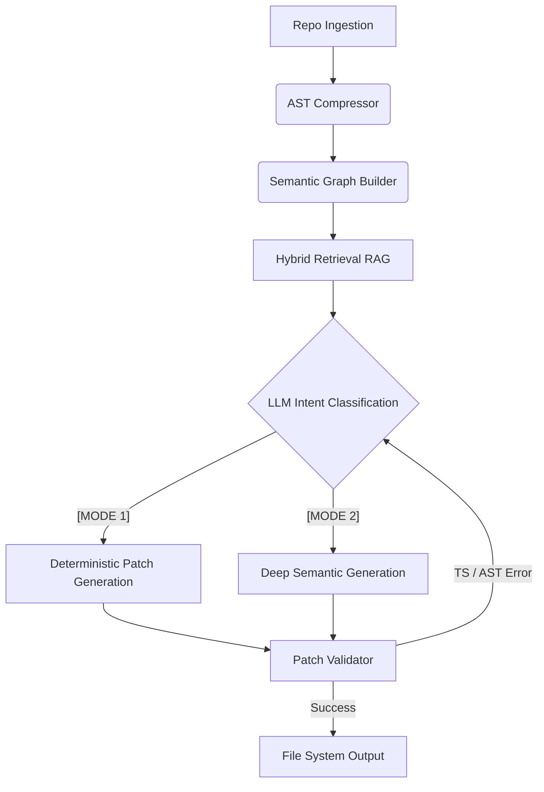

# Aokiro
**The Local-First Agentic AI Coding Architect**

Aokiro is a repository-aware AI coding engine designed to safely modify codebases, plan architectures, and generate applications fully autonomously. By leveraging AST compression, semantic dependency graphs, and deterministic patching, Aokiro completely mitigates the hallucination risks common in standard AI code generators.

## 🌟 Philosophy: Why Aokiro?

Most AI coding assistants act as intelligent copy-pasters. They lose context on large repositories, hallucinate imports, and break type safety. Aokiro is different.

**Aokiro does not overwrite files.** It relies on:
1. **AST Compression**: Distilling repositories into structural skeletons instead of raw, token-heavy code.
2. **Semantic Graphing**: Mapping dependencies, hooks, and API contracts into a strict graph.
3. **Deterministic Patching**: Emitting unified, surgical diffs that modify existing systems gracefully.
4. **Compiler-Guided Self-Correction**: Automatically running validation (like `tsc --noEmit`) and catching its own errors before prompting the user.

---

## ✨ Core Features

*   **Repository Ingestion**: Clone any repository and instantly compress its Abstract Syntax Tree.
*   **Dependency-Aware RAG**: Pull highly contextual information based on relational graphs (e.g., automatically injecting backend route contracts when generating frontend components).
*   **Mode Switching ([MODE 1] vs [MODE 2])**: Aokiro dynamically toggles between internal fine-tuned weights for standard coding tasks, and deep semantic retrieval for complex architectural integration.
*   **Autonomous Project Generation**: Feed Aokiro a concept, and it will plan, scaffold, generate, and type-check the entire project.
*   **Production CLI Interface**: Unified command-line ecosystem.

---

## 🏗 Architecture Flow



---

## 🛠 Installation Guide

### Prerequisites
*   **Node.js**: v18+ (for AST parsers, TypeScript compilation, and ESLint)
*   **Python**: v3.10+
*   **Hardware**: 16GB+ RAM. (For local model execution: NVIDIA GPU with CUDA 11.8+ recommended).

### 1. Clone & Setup Python Environment
```bash
git clone https://github.com/yourusername/aokiro.git
cd aokiro
python -m venv .venv

# Windows
.venv\Scripts\activate
# Mac/Linux
source .venv/bin/activate
```

### 2. Install Core Dependencies
If you have an NVIDIA GPU, install PyTorch with CUDA support first:
```bash
pip install torch torchvision torchaudio --index-url https://download.pytorch.org/whl/cu118
```
Then install the requirements:
```bash
pip install -r requirements.txt
# Alternatively, manual install:
pip install transformers accelerate datasets networkx langchain chromadb colorama typer
```

### 3. Environment Configuration
Copy the `.env.example` to `.env` and fill in your settings:
```bash
cp .env.example .env
```
Ensure your `LLAMA_SERVER_URL` points to your active local model server (e.g., `llama.cpp` or `ollama`).

---

## 💻 CLI Usage Examples

Aokiro exposes a powerful, unified CLI.

**Ingest a repository:**
```bash
aokiro ingest https://github.com/antfu/ni
```

**Generate a full project:**
```bash
aokiro generate todo-manager
```

**Evaluate Benchmark (Compile validation & Minimality):**
```bash
aokiro evaluate
```

**System Diagnostics:**
```bash
aokiro doctor
```

### The `todo-manager` Generation Demo
When you run `aokiro generate todo-manager`, Aokiro will:
1. Scaffold a Node.js/Express backend and React/Vite frontend into your `Documents` folder.
2. Trigger **[MODE 1]** for boilerplates and **[MODE 2]** for complex Zustand integrations.
3. Run `npm install` and `tsc` autonomously to verify types.
4. Auto-correct any hallucinated imports if the compiler fails.
5. Print the final execution commands and `localhost` URLs.

---

## 🚨 Installation Troubleshooting

Having issues? Check the common resolutions below:

### 1. `ModuleNotFoundError: No module named 'torch'` or `unsloth`
*   **Why**: You are trying to run the `train` pipeline without PyTorch or Unsloth installed, often on an AMD CPU. Unsloth natively requires Linux/WSL and NVIDIA CUDA.
*   **Fix**: Do not run the training module locally if you lack an NVIDIA GPU. Instead, use inference mode. Run `pip install torch transformers` to install standard CPU-compatible inference layers.

### 2. `Cannot reach llama-server at http://localhost:8080/completion`
*   **Why**: The Aokiro `LLMClient` expects an active local LLM running.
*   **Fix**: Download [LM Studio](https://lmstudio.ai/) or `llama.cpp` and start a local server on port 8080. Update the `LLAMA_SERVER_URL` in your `.env` file if your port differs.

### 3. `npm error could not determine executable to run` (Tailwind/Vite)
*   **Why**: `npx` failed to find the locally installed executable due to incomplete scaffolding or network drops during `npm install`.
*   **Fix**: Run `npm install` manually in the generated directory, or run `npm cache clean --force` and retry.

### 4. `ECMAScript imports and exports cannot be written in a CommonJS file`
*   **Why**: Aokiro generated TypeScript with `import/export` syntax while `package.json` defaulted to CommonJS without proper TS compilation targets.
*   **Fix**: Aokiro's compiler-loop usually auto-corrects this. If running manually, set `"type": "module"` in `package.json` or ensure `tsconfig.json` contains `"moduleResolution": "node"`.

### 5. `pnpm is not recognized as an internal or external command`
*   **Why**: The target repository relies on `pnpm` workspaces, but it's not installed globally on your machine.
*   **Fix**: Run `npm install -g pnpm`.
