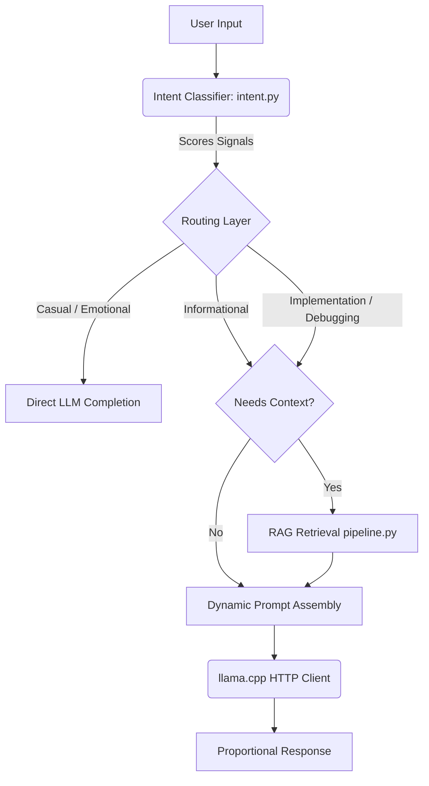
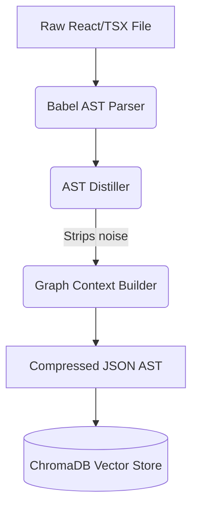
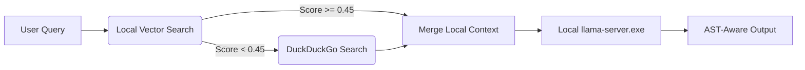

# Aokiro 🏛️ — The Architecture-Aware Local AI Systems Engine


> **Aokiro is a deeply engineered, local-first AI system that acts as a Senior Software Architect. It reasons over compressed codebases via AST, dynamically routes intent via multi-signal conversational intelligence, and runs completely offline on consumer hardware.**

---

## 🎯 Vision & Philosophy

Aokiro (formerly Architect-JS) exists to solve the fundamental failure of modern AI coding wrappers: **context window exhaustion and token bloat.**

When you feed a standard LLM a modern React/TypeScript codebase, it drowns in noise—CSS imports, boilerplate, massive JSX trees, and irrelevant utility functions. The context window fills up, memory degrades, and hallucination skyrockets. 

**Our Philosophy:**
1. **Never read raw code if you can read architecture.** We parse code into Abstract Syntax Trees (ASTs) and compress it into highly dense JSON representations.
2. **AI should not be a static prompt.** We use a multi-signal intent classification engine that understands *why* the user is typing, routing requests dynamically to different execution paths.
3. **Local is non-negotiable.** By compressing context from 5,000 tokens to 150 tokens, we enable sub-2B parameter models (running locally on hardware as low as an RTX 3050 4GB) to reason at the level of a senior engineer without expensive cloud APIs.

---

## ⚡ Why Aokiro Is Different

Aokiro is not another ChatGPT wrapper. It is a deeply engineered orchestration pipeline built to execute deterministic architectural workflows. 

* **Conversational Intelligence:** Aokiro does not use rigid "if message contains X" logic. Our Python-based intent classifier scores sentence structure, linguistic formality, specificity density, frustration signals, and conversational history to infer the exact intent of the user.
* **Multi-Stage Routing:** Based on the inferred intent (e.g., `debugging`, `brainstorming`, `casual`), the engine dynamically scales token budgets, adjusts generation temperatures, assembles intent-specific system prompts, and routes to entirely different LLM paths.
* **Retrieval Gating & Code Generation Gating:** Aokiro knows when *not* to search. Casual greetings or emotional vents bypass the RAG pipeline entirely, saving inference time. Code generation is strictly gated; "how does this work" triggers an explanation, while "build this" triggers deterministic code patching.
* **AST-Native Reasoning:** The Node.js pipeline (`ast-pipeline`) parses TS/React files using Babel, stripping away noise and extracting only the structural skeleton (hooks, dependencies, component boundaries, import graphs).
* **Compressed Architecture Memory & Graph Context:** By converting code into JSON ASTs, we create highly token-efficient structural memory that the Python RAG system vectors and queries.
* **Deterministic Architectural Editing:** Because the LLM receives structured JSON schemas instead of raw text, it generates localized architectural diffs rather than hallucinating entirely new files.
* **Local-First AI Workflows:** Complete orchestration between Node.js, Python, DuckDuckGo search fallbacks, and local `llama.cpp` servers—100% offline.

---

## 🧠 Architecture & Internal Flows

Aokiro relies on a heavily orchestrated pipeline that crosses boundaries between user intent, Python retrieval engines, Node.js AST parsing, and local C++ inference.

### 1. Request Flow (Conversational Routing)


### 2. AST Compression & Graph Flow


### 3. Inference & RAG Flow


---

## 🗣️ Conversational Intelligence System

The core of Aokiro's interactivity lives in `core_engine/intent.py`.

Unlike traditional assistants that use monolithic, generic system prompts ("You are a helpful assistant"), Aokiro uses a **Multi-Signal Intent Classification Engine**.

* **How it works:** Every message is tokenized and scored across several heuristics:
  * **Sentence Structure:** Interrogative vs Imperative openers.
  * **Formality:** Slang, contractions, and capitalization (pushes to `casual`).
  * **Specificity Density:** Ratio of content words, error logs, or file paths (pushes to `debugging` or `implementation`).
  * **Frustration Markers:** Multiple exclamation points or curse words override other metrics to trigger `emotional` or `debugging` handlers.
  * **Historical Continuity:** Evaluates the last 3 turns with a decay factor to maintain conversational state.
* **Dynamic Orchestration:** Once an intent is scored (e.g., `BRAINSTORMING`, `NEUTRAL`, `NORMAL`), `llm_client.py` intercepts it. It builds a micro-system prompt specifically for that intent, adjusts the `max_tokens` limit to prevent verbosity (e.g., 250 tokens for a casual chat), and tweaks the temperature (higher for brainstorming, lower for debugging).
* **Limitations:** Context history is kept out of the LLM prompt to save tokens, meaning the LLM itself is technically stateless, though the intent router is stateful. Highly ambiguous short phrases can occasionally misroute.

---

## 🏗️ Project Structure Breakdown

### Python Core Engine (`core_engine/`)
The primary orchestrator and backend system.

* `main.py`
  * **Role:** The entry point and CLI orchestration layer.
  * **Function:** Handles the TUI (via `rich` and `click`), manages the conversation loop, interfaces with `intent.py`, and conditionally triggers RAG vs direct LLM completion based on routing rules.
* `intent.py`
  * **Role:** Multi-signal intent classification engine.
  * **Function:** Scores user input to determine `Intent`, `Tone`, `Depth`, `wants_code`, and `needs_rag`. Returns `IntentResult` metadata.
  * **Used by:** `main.py` to route logic; `llm_client.py` to assemble prompts.
* `llm_client.py`
  * **Role:** The HTTP bridge to `llama.cpp`.
  * **Function:** Takes `IntentResult` metadata to dynamically assemble specific system prompts. Generates ChatML formatted requests. Manages temperature and token constraints.
* `config.py`
  * **Role:** Environment and system configuration.
  * **Function:** Maps `.env` variables to Python dataclasses (`LlamaConfig`, `RagConfig`, `WebSearchConfig`).
* `tools/js_bridge.py`
  * **Role:** IPC bridge.
  * **Function:** Executes Node.js AST parsing scripts as subprocesses from Python.

### RAG Pipeline (`core_engine/rag/`)
The contextual retrieval and embedding generation layer.

* `pipeline.py`
  * **Role:** End-to-end RAG orchestrator.
  * **Function:** Manages the ingest → chunk → embed → store → retrieve flow. Implements the fallback logic to web search if local codebase vectors fall below `0.45` similarity.
* `ingestion.py`
  * **Role:** Document parsing.
  * **Function:** Scans directories, reads files, and splits code/text into overlapping chunks for embedding.
* `embedder.py`
  * **Role:** Vector generation.
  * **Function:** Uses `sentence-transformers` (`all-MiniLM-L6-v2`) to convert text chunks into high-dimensional vector embeddings.
* `store.py`
  * **Role:** Vector Database adapter.
  * **Function:** Interfaces with ChromaDB. Stores, retrieves, and manages collections of chunk embeddings.
* `retriever.py` & `web_retriever.py`
  * **Role:** Search interfaces.
  * **Function:** `retriever.py` searches ChromaDB. `web_retriever.py` falls back to DuckDuckGo via the `ddgs` wrapper for real-time data.

### AST & Node.js Systems (`packages/ast-pipeline/` & `src/analyzer/`)
The architecture extraction engine.

* `packages/ast-pipeline/src/index.ts` (and submodules)
  * **Role:** The structural TypeScript parsing pipeline.
  * **Function:** Uses Babel to traverse React/TS files, extract component signatures, identify hooks, map dependencies, and output highly compressed architectural JSON.
* `src/analyzer/ast_compressor.js`
  * **Role:** CLI tool for AST compression.
  * **Function:** Reads a TSX file, extracts the AST, and enforces a strict token limit using `tiktoken` to ensure the output fits in small local context windows.

### Training & Evaluation (`src/training/` & `src/distiller/`)
* `src/training/train_unsloth.py`
  * **Role:** Model fine-tuning script.
  * **Function:** Uses `unsloth` to apply QLoRA fine-tuning to Qwen 2.5 on custom architectural JSON datasets. Packs the model into GGUF format for `llama.cpp`.
* `src/distiller/inference_test.js`
  * **Role:** Evaluation pipeline.
  * **Function:** Tests inference accuracy, measures token usage, and gates quality for generated AST patches.

---

## 📦 External Dependency Documentation

Aokiro heavily relies on specific external libraries for speed, privacy, and parsing.

### Python Dependencies
* **`chromadb` (v0.5.0+)**: Vector database. Used in `store.py` for fully local, persistent embedding storage.
* **`sentence-transformers` (v3.0.0+)**: Embedding engine. Used in `embedder.py` to run the `all-MiniLM-L6-v2` model locally to generate vectors.
* **`duckduckgo-search` (`ddgs`)**: Real-time web retrieval. Used in `web_retriever.py` as a fallback when the local RAG DB doesn't have an answer. Requires zero API keys.
* **`rich` & `click`**: Terminal user interface. Used in `main.py` for beautiful, asynchronous console rendering and CLI command routing.
* **`unsloth` & `transformers`**: Training stack. Used in `train_unsloth.py` for highly optimized, 4-bit LoRA fine-tuning of local models.

### Node.js Dependencies
* **`@babel/parser`, `@babel/traverse`, `@babel/types`**: The core AST engine. Used heavily in `ast-pipeline` to read and destruct source code into structural nodes.
* **`tiktoken`**: OpenAI's token counter, ported to JS. Used in `ast_compressor.js` to rigidly validate that JSON AST outputs do not exceed the local LLM's context window.

---

## 📥 Local Model & Download Documentation

Because Aokiro is completely local, you must download the inference binaries and models yourself.

### 1. The Inference Engine: `llama.cpp`
* **What it is:** High-performance C++ inference engine for running LLMs on consumer CPU/GPUs.
* **Where to get it:** [llama.cpp Releases](https://github.com/ggerganov/llama.cpp/releases).
* **Required file:** The pre-compiled binary (`llama-server.exe` on Windows). Download the version matching your hardware (e.g., `llama-bxxxx-bin-win-cuda-cu12.2-x64.zip` for Nvidia GPUs).
* **Setup:** Extract the zip and place `llama-server.exe` (and its `.dll` files) directly in the `c:\Aokiro` root directory.

### 2. The Model: GGUF Format
* **What it is:** The quantized, local version of an LLM. Aokiro is heavily optimized for the **Qwen 2.5 Coder** series.
* **Where to get it:** HuggingFace. We recommend `Qwen/Qwen2.5-Coder-1.5B-Instruct-GGUF`.
* **Required file:** A quantized GGUF file, e.g., `qwen2.5-coder-1.5b-instruct-q4_k_m.gguf`.
* **Setup:** Place the file in the `c:\Aokiro\models\` directory. Update your `.env` file to point to this path.

### 3. The Embedding Model
* **What it is:** `all-MiniLM-L6-v2`. A tiny, lightning-fast embedding model.
* **Setup:** Handled automatically by `sentence-transformers` on first run. It will download the ~90MB model and cache it locally.

---

## 🛠️ Installation & Setup

### Prerequisites
* **OS:** Windows 10/11, macOS, or Linux.
* **Python:** v3.10 or higher.
* **Node.js:** v18.0 or higher.
* **Hardware:** Minimum 8GB RAM. GPU highly recommended (CUDA/Nvidia, minimum 4GB VRAM like RTX 3050) for fast inference.

### Step-by-Step Setup

1. **Clone the Repository**
   ```bash
   git clone https://github.com/your-username/aokiro.git
   cd aokiro
   ```

2. **Download `llama-server` and Models**
   * Place `llama-server.exe` (and DLLs) in the project root.
   * Place your `.gguf` model in the `models/` directory.

3. **Run the Setup Script**
   * **Windows:**
     ```powershell
     .\setup.bat
     ```
   * **Mac/Linux:**
     ```bash
     chmod +x setup.sh
     ./setup.sh
     ```
   *(This will create the Python `.venv`, install pip requirements, install npm requirements across the workspace, and build the TypeScript AST pipeline).*

4. **Environment Variables**
   The setup script creates a `.env` file. You must verify it:
   ```env
   LLAMA_SERVER_URL=http://localhost:8080
   LLAMA_MODEL_PATH=models/qwen2.5-coder-1.5b-instruct-q4_k_m.gguf
   RAG_DB_PATH=./data/rag_db
   WEB_SEARCH_ENABLED=true
   ```

---

## 💻 CLI Usage

Aokiro is driven via two terminal windows.

**Terminal 1: Start the Inference Server**
```powershell
.\llama-server.exe -m models\qwen2.5-coder-1.5b-instruct-q4_k_m.gguf -c 2048 --port 8080
```
*(Leave this running in the background).*

**Terminal 2: Run the Aokiro Interface**
```powershell
.\.venv\Scripts\activate
python core_engine\main.py
```

From the Aokiro interface, you can:
* Chat directly with the Conversational Intelligence engine.
* Type `/index` or run `python core_engine\main.py index --path ./src` to chunk and embed your codebase into ChromaDB.
* Run RAG-augmented queries.

---

## ⚖️ Advantages, Limitations & Tradeoffs

### Advantages
* **Architecture-Aware Reasoning:** Sees the skeleton of the code, not the boilerplate, preventing the LLM from getting lost in utility functions.
* **Extremely Low Token Usage:** Compresses 5k tokens of React into ~150 tokens of JSON, fitting into tiny context windows with near-instant Time-to-First-Token.
* **Conversational Adaptability:** Doesn't act like a robot unless you ask it to code.
* **Total Local Privacy:** Code never leaves your machine.

### Limitations
* **AST Parsing Limitations:** If your code contains massive syntax errors, Babel will fail to parse it, meaning Aokiro cannot compress it or read it.
* **Orchestration Complexity:** Juggling Python virtual environments, Node.js packages, and C++ inference binaries is brittle and prone to pathing/environment errors.
* **Hardware Requirements:** While designed for low-end GPUs, running `llama-server` and `chromadb` simultaneously on a machine with exactly 8GB of total system RAM will cause swap-thrashing.
* **Graph Synchronization:** Currently, if you modify files outside of Aokiro, the local ChromaDB index goes stale and must be manually re-indexed.

---

## 🚀 Roadmap
- [ ] Automatic watch-mode background indexing for RAG.
- [ ] Direct IDE integration (VSCode Extension IPC).
- [ ] Expanding the AST Pipeline to support Python source code via `tree-sitter`.
- [ ] Deep graph memory context injection (loading imported dependencies automatically alongside the primary AST).

---

*Aokiro — MIT License 2026.*
