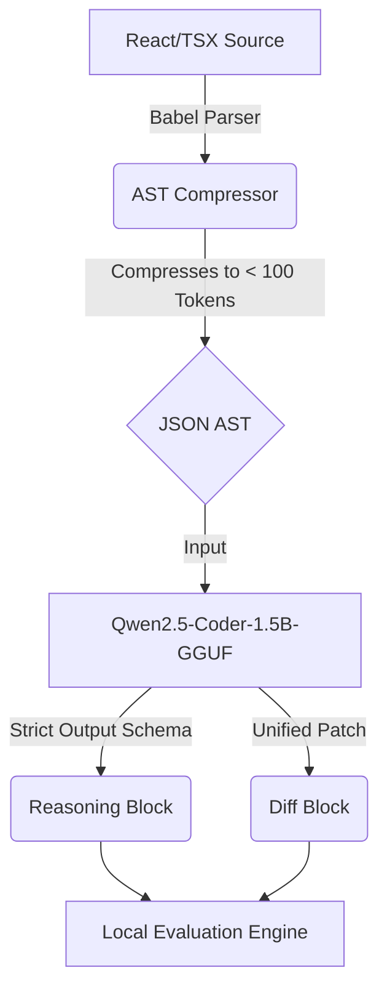

# Architect-JS 🏛️


> **A highly specialized, local-first AI coding assistant that thinks like a Senior Software Architect.**

Architect-JS represents a paradigm shift in local LLM coding assistants. Instead of feeding large, noisy, raw source code files into context windows, Architect-JS reads **compressed Abstract Syntax Tree (AST) & Dependency Graph JSON representations**. This allows a 1.5B parameter model running on consumer hardware (e.g., RTX 3050 4GB) to reason about massive codebases with zero cloud dependency.

---

## 🎯 Project Goals & Local-First Philosophy

The goal of Architect-JS is to bring Senior Staff Engineer level architectural reasoning to local, low-resource hardware. 
Cloud APIs (OpenAI, Anthropic) are powerful but expensive, slow, and pose privacy risks. By combining a $0-cost automated training pipeline, deterministic AST extraction, and aggressive `Q4_K_M` quantization via `llama.cpp`, we enable deep codebase intelligence entirely offline.

## 🧠 Why Compressed AST over Raw Code?

Traditional coding models struggle with long-context memory degradation and VRAM exhaustion. An average React component might be 500 lines of code (~5,000 tokens). By parsing the file with Babel and extracting *only* the architectural skeleton (hooks, imports, exports, dependency arrays, child elements), we compress the context to **~70-150 tokens**. 

This 50x token compression allows the model to "see" multiple files simultaneously without overflowing KV caches on a 4GB GPU.

---

## 🏗️ Architecture & Pipeline Overview

Architect-JS operates on a strict, deterministic pipeline divided into distinct engines:



### Folder Structure
```text
architect-js/
├── data/
│   ├── manual_fixes.json     # Ground truth SFT reasoning
│   ├── test_ast/             # Extracted JSON outputs
│   ├── test_files/           # Raw React/TSX benchmark files
│   └── train.jsonl           # Final compiled dataset
├── src/
│   ├── analyzer/             # Babel AST extraction & formatting
│   ├── distiller/            # Validation, inference testing, semantic scoring
│   └── training/             # Unsloth / QLoRA Colab scripts
├── docs/                     # Architecture & design documents
├── logs/failures/            # LLM benchmark failure dumps
├── README.md
└── VALIDATION.md
```

---

## 🚀 Features Completed So Far
- [x] **Zero-Cost Training Pipeline:** No paid APIs used.
- [x] **AST Compressor Engine:** Babel-based extraction of imports, hooks, and relationships.
- [x] **Strict Token Management:** Automatic `tiktoken` enforcement (< 3500 tokens).
- [x] **SFT Dataset Compiler:** Automated merging of ASTs with ground-truth reasoning.
- [x] **Evaluation Infrastructure:** Built-in inference tester targeting local `llama.cpp` servers.
- [x] **Colab Integration:** 1-click Unsloth Jupyter notebook for training Qwen2.5.

---

## 💡 Example Data Flow

### 1. Compressed AST Input (JSON)
```json
{
  "file": "ChatBox.tsx",
  "exports": ["ChatBox"],
  "imports": ["react", "socket.io-client"],
  "hooks": ["useEffect", "useState", "useAuth"],
  "deps": {
    "useEffect": ["roomId", "handleMsg"]
  },
  "children": ["MessageBubble"]
}
```

### 2. Model Output (`<thought>` / `<diff>`)
```xml
<thought>
The useEffect initiates a websocket connection but fails to return a cleanup function. This will result in memory leaks and duplicate socket listeners upon component re-render. We must return a function that calls socket.off() and socket.disconnect().
</thought>
<diff>
@@ -15,4 +15,5 @@
   useEffect(() => {
     socket.on('message', handleMsg);
+    return () => socket.off('message', handleMsg);
   }, []);
</diff>
```

---

## ⚙️ Installation & Quick Start

### Prerequisites
- Node.js v18+
- Python 3.10+
- `llama.cpp` (compiled locally)

### Setup
```bash
# Install Node dependencies
cd src/analyzer && npm install

# Install Python ML dependencies
cd ../../
python3 -m venv .venv
source .venv/bin/activate
pip install -r requirements.txt
```

### Usage Examples
**1. Compress a React Component**
```bash
node src/analyzer/ast_compressor.js ./path/to/Component.tsx
```

**2. Compile the SFT Dataset**
```bash
node src/analyzer/build_dataset.js
```

**3. Evaluate Local Inference Model**
*(Requires `llama-server` running on port 8080)*
```bash
node src/distiller/inference_test.js
```

---

## 🛠️ Development & Contribution

> [!WARNING]  
> **Experimental Research Prototype**  
> Architect-JS is actively under development. The AST schema is subject to breaking changes. Do not use generated patches directly in production without manual review.

### Contribution Guidelines
We welcome contributions particularly in:
1. Expanding the `jscodeshift` synthetic bug mutation heuristics.
2. Adding static analysis hooks for non-React frameworks (Vue, Svelte).
3. Improving the `inference_test.js` compilation checks.

Please read `VALIDATION.md` for strict local testing requirements before submitting PRs.

### Current Limitations
- The AST compressor currently drops deeply nested inline-functions to save tokens.
- TypeScript compiler validation assumes standard `tsconfig.json` paths.
- Local inference requires roughly ~1.5GB of VRAM for the Q4_K_M model.

### Future Research Directions
- Implementing **Direct Preference Optimization (DPO)** tournaments locally using ESLint cyclomatic complexity scores as the reward model.
- Expanding AST graph parsing to include global state managers (Redux, Zustand).
- Multi-file repository ingestion and vector-db AST mapping.
# Aokiro
