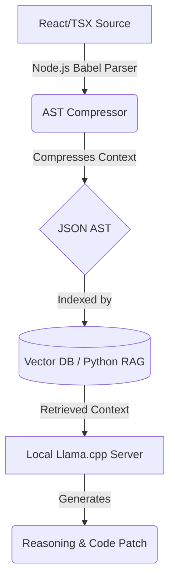

# Aokiro 🏛️


> **A highly specialized, local-first AI coding assistant that thinks like a Senior Software Architect.**

Aokiro (formerly Architect-JS) represents a paradigm shift in local LLM coding assistants. Instead of feeding large, noisy, raw source code files into context windows, Aokiro reads **compressed Abstract Syntax Tree (AST) & Dependency Graph JSON representations**. This allows a 1.5B parameter model running on consumer hardware (e.g., RTX 3050 4GB) to reason about massive codebases with zero cloud dependency.

---

## 🎯 What is this project? (Project Overview)

Aokiro is a specialized, local-first AI coding assistant that acts like a Senior Software Architect. It uses a hybrid system combining **Node.js** (for parsing source code into a compressed Abstract Syntax Tree) and **Python** (for running a Retrieval-Augmented Generation (RAG) engine). 

It allows you to analyze, chat with, and debug your codebases entirely offline on local hardware, without paying for expensive cloud APIs and with zero privacy risks.

---

## 🧠 How it works (Architecture Flow)

Traditional coding models struggle with long-context memory degradation and VRAM exhaustion. An average React component might be 500 lines of code (~5,000 tokens). By parsing the file and extracting *only* the architectural skeleton, we compress the context to **~70-150 tokens**.

1. **AST Extraction (Node.js)**: Parses React/TypeScript files and extracts only the structural skeleton (hooks, imports, exports, dependency arrays, child elements).
2. **Context Compression**: Compresses the code logic into highly token-efficient JSON graphs.
3. **RAG Pipeline (Python)**: Indexes these parsed JSON elements into a local Vector Database. When you query the codebase, it retrieves only the relevant AST nodes.
4. **Local LLM Inference**: Sends the compressed context to a locally running model using `llama.cpp` to generate strict architectural reasoning and code diffs.



---

## ✅ What has been done (Current Features)

- **Node.js AST Compressor Engine**: Built Babel-based extraction of React/TSX structures, imports, hooks, and relationships.
- **Python RAG Core Engine**: Implemented a fully functional local RAG pipeline with vector search capabilities.
- **Cross-Language Bridge**: Stabilized the connection between the Node.js AST parsing pipeline and the Python RAG Engine.
- **Local Inference Integration**: Integrated `llama.cpp` server for zero-cost, local model execution without cloud dependencies.
- **CLI Interface**: Deployed a production-ready Python command-line tool for codebase indexing and interaction.
- **Zero-Cost Training Pipeline**: Setup complete for training custom models via QLoRA.

---

## ⚙️ Detailed Installation Guide (How to Install)

### Prerequisites
- Node.js (v18+)
- Python (3.10+)
- `llama.cpp` pre-compiled binaries (specifically `llama-server.exe` on Windows).

### Step 1: Download `llama.cpp` Server
To run models locally, you need the `llama-server` binary:
1. Go to the `llama.cpp` [releases page](https://github.com/ggerganov/llama.cpp/releases).
2. Download the appropriate pre-compiled Windows zip (e.g., `cuda` for Nvidia GPUs, or `vulkan`).
3. Extract the `.zip` file and find `llama-server.exe`.
4. Copy `llama-server.exe` and paste it directly into your Aokiro project root directory (`c:\Aokiro`).

### Step 2: Run the Automated Setup
Aokiro provides scripts to automatically create a Python virtual environment, install Python requirements, and build the Node.js packages.

**On Windows:**
```powershell
.\setup.bat
```

**On Mac/Linux:**
```bash
./setup.sh
```

### Step 3: Configure Environment Variables
Copy the template environment file to activate your settings:
```powershell
copy .env.example .env
```
*(The default `.env` configuration already points to the local `llama-server` on port 8080)*

### Step 4: Run the Local LLM Server
Start the local server using your downloaded GGUF model. **Leave this running in its own terminal.**

```powershell
.\llama-server.exe -m models\architect-js-1.5b-unsloth.Q4_K_M.gguf -c 2048 --port 8080
```

### Step 5: Start the Aokiro Core Engine
Open a **new** terminal window, activate the virtual environment, and launch the interactive CLI to start indexing and chatting with your codebase!

```powershell
# Activate the environment
.\.venv\Scripts\activate

# Launch the CLI
python core_engine\main.py
```

### Useful CLI Commands
Once inside the Python CLI, you can use:
- `python core_engine\main.py index --path data\` (To index a specific folder)
- `python core_engine\main.py query "useEffect cleanup"` (To ask a question based on indexed code)
