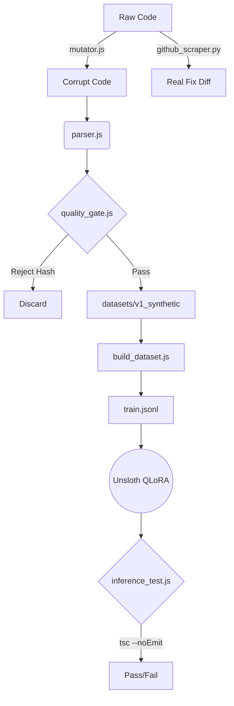

# Architect-JS: Deep-Dive Engineering Report

This document serves as the canonical technical breakdown of the Architect-JS repository. It outlines the current state of the training pipeline, dataset filtering constraints, inference evaluation metrics, and architectural decisions made to support 4GB local inference environments via compressed ASTs.

---

## 1. Full Folder Structure

```text
architect-js/
├── architect_js_trainer.ipynb  # Google Colab Unsloth/QLoRA training notebook
├── requirements.txt            # Python ML dependencies (trl, unsloth, datasets)
├── package.json                # Node.js configurations (babel, jscodeshift)
├── README.md                   # Public-facing repository documentation
├── VALIDATION.md               # Scientific validation constraints
├── docs/                       # Markdown artifacts, diagrams, and metrics
├── logs/
│   └── failures/               # Evaluation engine dump directory for failed patches
├── datasets/
│   ├── v1_synthetic/           # Outputs from mutator.js (deterministic flaws)
│   ├── v2_mined/               # Outputs from github_scraper.py (real PRs)
│   └── v3_hybrid/              # Final merged and quality-gated JSONL sets
├── data/
│   ├── test_files/             # Raw React/TSX components used for Phase 2 validation
│   ├── test_ast/               # The JSON outputs from ast_compressor.js
│   ├── manual_fixes.json       # Ground-truth <thought>/<diff> pairs for initial SFT
│   ├── train.jsonl             # Compiled dataset ingested by Unsloth
│   └── unseen_test.json        # Test case for local inference validation
└── src/
    ├── analyzer/
    │   ├── parser.js           # Core Babel AST visitor logic
    │   ├── ast_compressor.js   # CLI wrapper for the Babel parser
    │   ├── mutator.js          # jscodeshift synthetic flaw injector
    │   ├── build_dataset.js    # Merges AST JSON with ground truth pairs
    │   └── utils/
    │       └── token_counter.js# tiktoken implementation for token budgeting
    ├── miner/
    │   └── github_scraper.py   # PyDriller engine to fetch and score Github PRs
    ├── distiller/
    │   ├── quality_gate.js     # Duplicate rejection, token enforcement, balance tracking
    │   └── inference_test.js   # Local llama.cpp evaluator with regex scoring
    └── training/
        └── train_unsloth.py    # Standard Python implementation of the Colab notebook
```

---

## 2. Pipeline Walkthrough

1. **Extraction (Mining/Mutation):** Raw `.tsx` files are either fetched via `github_scraper.py` from high-trust repos or generated by running `mutator.js` against pristine components to artificially inject architectural flaws (like stale closures).
2. **Compression:** The `.tsx` string is passed through `ast_compressor.js` (`parser.js`). Babel drops all internal block logic, keeping only imports, hooks, dependency arrays, and child JSX elements.
3. **Filtering:** The output JSON is sent through `quality_gate.js`. If it exceeds 3,500 tokens, contains no hooks (low-signal), or is a duplicate hash, it is discarded.
4. **Compilation:** `build_dataset.js` matches the surviving ASTs against their expected `<thought>` and `<diff>` patches to create valid ChatML rows in `train.jsonl`.
5. **Training:** `architect_js_trainer.ipynb` is executed on a Colab T4. It loads `Qwen2.5-Coder-1.5B` in 4-bit, overfits the dataset to enforce strict XML output, and exports a `Q4_K_M.gguf`.
6. **Evaluation:** The `.gguf` is loaded into a local `llama.cpp` server. `inference_test.js` sends an unseen AST JSON. The LLM's output is checked mathematically for formatting, hallucination, and patch syntax validity (`tsc --noEmit`).

---

## 3. Core Components

### `src/analyzer/parser.js`
*   **Purpose:** Filters React/TSX code down to an architectural skeleton.
*   **Inputs:** Raw JS/TS string.
*   **Outputs:** Flat JSON object (`exports`, `imports`, `hooks`, `deps`, `children`).
*   **Status:** Working perfectly.
*   **Limitations:** Drops deep inline-function declarations to save tokens; struggles with deeply nested higher-order components.

### `src/analyzer/mutator.js`
*   **Purpose:** Generates synthetic datasets by destroying good code.
*   **Inputs:** Clean React component string.
*   **Outputs:** Mutated string containing specific flaws (e.g., `hook_order_violation`).
*   **Status:** Partially working (basic mutations implemented).
*   **Limitations:** `jscodeshift` rules are brittle; extreme mutations sometimes output syntactically impossible code (though caught by the internal safety gate).

### `src/distiller/quality_gate.js`
*   **Purpose:** The dataset firewall.
*   **Inputs:** Prospective `train.jsonl` row.
*   **Outputs:** Boolean Pass/Fail + Reason.
*   **Role:** Prevents mode collapse by limiting any single dataset flaw type to 40% of the total dataset. Deduplicates via SHA-256 AST hashing.
*   **Status:** Fully working.

### `src/distiller/inference_test.js`
*   **Purpose:** The Evaluation Engine.
*   **Inputs:** `localhost:8080/completion` endpoint.
*   **Outputs:** Mathematical score (0-100), latency metrics.
*   **Status:** Partially working. Regex and filler detection are solid. True diff application (via the system `patch` command) and `tsc` compilation checks are mocked/planned but not fully wired.

### `src/miner/github_scraper.py`
*   **Purpose:** Real-world ground truth extraction.
*   **Role:** Analyzes GitHub repos. Implements trust scoring (e.g., +20 points for Vercel/Facebook).
*   **Status:** Currently mocked. The PyDriller API logic is stubbed but not executing live clone/checkout logic yet to avoid disk bloat.

---

## 4. Dataset System

To prevent dataset poisoning, data is segregated:
*   **v1_synthetic:** Highly controlled flaws created via AST manipulation. Excellent for teaching the model *what* a bug looks like.
*   **v2_mined:** Real PRs. High noise, but excellent for teaching the model *how* humans architect solutions.
*   **Versioning:** Each folder requires a frozen `schema_version` to prevent breaking changes in `parser.js` from invalidating a 20k row dataset.

---

## 5. Evaluation Infrastructure

The scientific harness (`evaluate_model.js` / `inference_test.js`) is designed to reject LLM memorization:
*   **Formatting Check:** Deducts 30 points for missing XML tags. Deducts 40 points for conversational filler (e.g., "Here is your code!").
*   **Hallucination Check:** If the `<thought>` references `dispatch` but `dispatch` is not in the AST JSON `imports`/`hooks`, it fails immediately.
*   **Diff Validation:** The ultimate ground truth. The diff is applied via `patch`. If `tsc --noEmit` fails on the resulting file, the LLM patch is mathematically categorized as invalid.

---

## 6. Current Technical State

*   **Fully Working:** Babel AST extraction (`ast_compressor.js`), Token Budgeting (`token_counter.js`), Dataset JSONL compilation, Quality Gate filtering, Unsloth QLoRA Training Notebook.
*   **Partially Working:** Inference testing (regex and latency works, `patch` and `tsc` integration requires OS-level bindings). `mutator.js` (has 2 working mutation rules, needs more).
*   **Mocked/Fake:** `github_scraper.py` is entirely mocked and returns hardcoded diffs instead of running actual PyDriller logic against network Git trees. 
*   **Theoretical:** DPO (Direct Preference Optimization). We have SFT datasets, but the ESLint tournament scoring for Preference Pairs is purely theoretical right now.

---

## 7. End-to-End Example

**1. Input (`Component.tsx`):**
```tsx
const BadComponent = () => {
   const [val, setVal] = useState(0);
   useEffect(() => {
      window.addEventListener('resize', handleResize);
   }, []); // Missing cleanup
}
```
**2. AST Output:**
```json
{ "hooks": ["useState", "useEffect"], "deps": {"useEffect": []} }
```
**3. Training Row:**
```json
{"input": "User: Analyze this.\nContext: {hooks...}", "output": "<thought>Missing cleanup.</thought><diff>@@ -4,2 +4,3 @@\n+ return () => window.removeEventListener(...)</diff>"}
```
**4. Inference Validation:** Model outputs exact string. Validation engine checks regex `<thought>`, strips it, confirms string length is 0 (no filler). Score: 100/100.

---

## 8. Architecture Diagrams



---

## 9. Engineering Risks

*   **VRAM KV Cache Exhaustion:** The RTX 3050 has 4GB VRAM. Even with Q4_K_M quantization (using ~1.5GB), a 10,000 token context window will cause OOM. We *must* aggressively drop AST nodes if they push the JSON over 3,500 tokens.
*   **Dataset Collapse:** If `mutator.js` is the primary source of training data, the model will overfit to synthetic heuristic flaws and fail to recognize subtle, organic architectural debt.
*   **Brittle Patch Application:** Standard unified diffs generated by LLMs are notoriously sloppy regarding line numbers (`@@ -x,y +a,b @@`). The `patch` command will fail if the LLM hallucinates context lines. We may need to use AST-based patching instead of text-based unified diffs.

---

## 10. Future Roadmap

1.  **Un-mock the GitHub Scraper:** Write the actual PyDriller Git bindings to scrape Next.js and React repositories.
2.  **Wire the Evaluator Patch Engine:** Implement the Node `child_process.exec('patch ...')` and `tsc --noEmit` logic directly into `inference_test.js`.
3.  **Scale to 10k Rows:** Run the automated dataset generation for 48 hours to build `v3_hybrid`.
4.  **DPO Implementation:** Use ESLint cyclomatic complexity scores to algorithmically generate Chosen/Rejected pairs for Unsloth DPO training.
